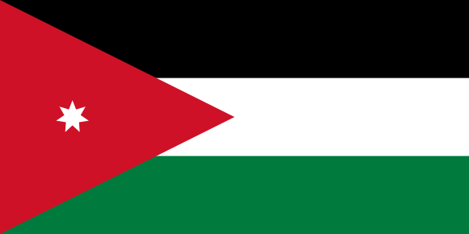

# مرحبًا بك في دليل المستخدم لمنصة فلاحة شبكة الغذاء المفتوح

| Language version | Link to the user guide |
| :--- | :--- |
|  | أنت تقرأ النسخة العربية! |
|  | [_Open food Network - User Guide  English version_](https://guide.openfoodnetwork.org/) |
|  | [Accéder à la version française du guide utilisateur Open Food Network](https://ofn-user-guide.gitbook.io/guide-utilisateur-open-food-network/) |
|  | [Accediu a la versió catalana de la guia d'usuari de Open Food Network](https://guia.katuma.org/) |

### تم تصميم دليل المستخدم هذا لمساعدتك في تحقيق أقصى استفادة من منصة Open Food Network لدعم تشغيل مؤسسات الأغذية المحلية و "سلاسل الأغذية القصيرة" أينما كنت.

## لمحة عامة

#### تمكّن فلاحة المواطنين من بناء طرق أفضل وأكثر عدلاً للحصول على طعامهم محليًا وبشكل مباشر من المزارعين والمنتجين. يمكن لشبكات موسعة من صغار منتجي الأغذية والموزعين وتجار التجزئة ومراكز الطعام والتعاونيات الغذائية ومجموعات الشراء أن تتحد مع مساعدة منصة فلاحة كشبكة غذاء مفتوحة لإيجاد أفضل طريقة لتقصير سلسلة التوريد الغذائي وتساعد في بناء مجتمعات قوية.

The Open Food Network is a global project that supports the operational organisation of farmers, groups of consumers, cooperatives, etc. in the distribution of local food. The software we build is open source, and we collaborate with amazing people from all over the world to keep improving it! We also provide support in the organisational aspects of setting up and running a food hub. Please get in touch with [your local OFN contact](local-ofn-organizations-and-contacts.md) to learn more about us!

This short video will give you a brief introduction to how the Open Food Network works, and what we can do for your food business, or organisation.



## How to use this guide?

### &gt; Quick setup guides tailored to your enterprise

Starting scratch, open an online shop that perfectly fits your needs [in a few simple steps](your-quick-start-on-ofn-given-who-you-are.md)!


We recommend these guides to users starting out on the Open Food Network platform for the first time.


### &gt; Features to meet your needs

Find a [detailed explanation of every feature our platform offers](basic-features/), so you can set up your Open Food Network enterprise to specifically meet your local needs.


We recommend these guides to users who would like to customise their Open Food Network enterprise specifically to meet the needs of their business or customers.



They are also a great resource for answering any questions you may have.


### _&gt;_ Guidelines on complementary software you might like to use in combination with the Open Food Network

The Open Food Network does a lot of things, but no one tool can fit all needs. We have listed [some needs for which you might need complementary software, and how you can set them up](complementary-tools-software/) to work hand in hand with your local Open Food Network platform.

### &gt; Trouble shooting

Still not finding what you need ? Check the [Trouble Shooting section](trouble-shooting.md) to see if others had the same questions as you!

### &gt; Search

Looking for information on something specific? Use the search bar in the top left corner to find the information you need.

## Feedback

Any difficulty with that user guide? Any information missing? Or maybe you want to share some features you would like to see in the future? Get in touch with [your local OFN entity](local-ofn-organizations-and-contacts.md) for any feedback!

