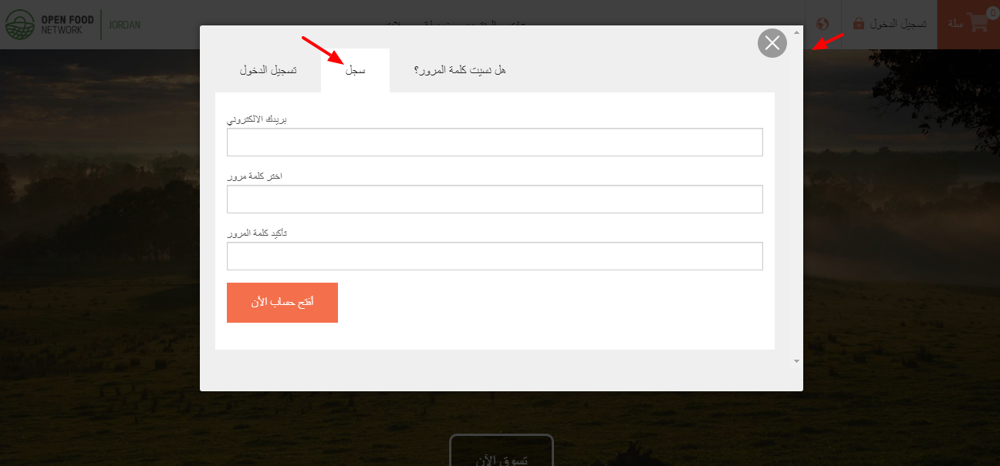
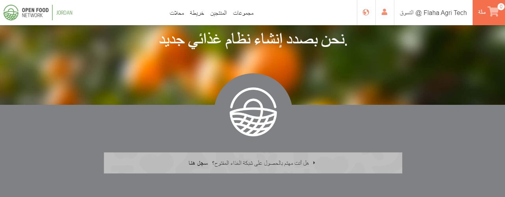
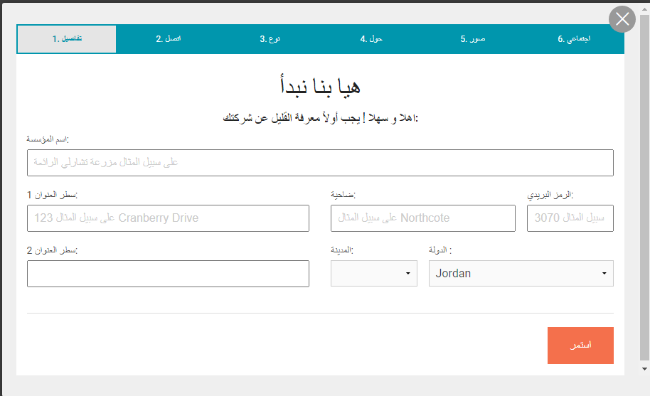
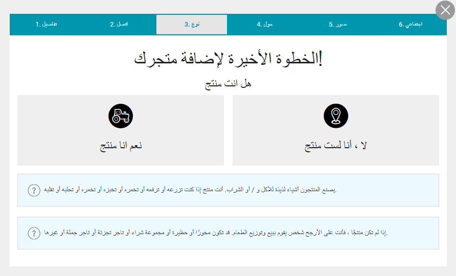

# التسجيل وانشاء حساب مؤسستك

### إنشاء حساب المستخدم الخاص بك

▪ من الصفحة الرئيسية ، انقر فوق "تسجيل الدخول" في الزاوية اليمنى العليا ، ثم "تسجيل"

▪ أدخل عنوان بريدك الإلكتروني واختر كلمة مرور  
▪ سوف تتلقى رسالة بريد إلكتروني في الدقائق القليلة القادمة مع رابط التأكيد. اضغط عليها وستتم إعادة توجيهك إلى صفحة تسجيل الدخول.  
 ▪ تسجيل الدخول


إذا لم تتلق رسالة تأكيد بالبريد الإلكتروني منا على الفور ، فربما تكون قد انتقلت إلى صندوق البريد العشوائي / البريد العشوائي.


### قم بإنشاء حساب "الشركة" الأول الخاص بك

* 
▪ بمجرد تسجيل الدخول ، انقر فوق لافتة باللون الرمادي العلوي "هل أنت مهتم بالبيع من خلال منصة فلاحة ؟ سجل هنا."

▪ انقر فوق مربع "أوافق على شروط الخدمة أعلاه" وحدد "هيا نبدأ!"

▪ املأ اسم مؤسستك وتفاصيل الاتصال الخاصة بك


سيتم استخدام عنوانك لإضافة عملك إلى خريطتنا الخاصة بمؤسسات فلاحة جو وبالتالي زيادة ظهورك.


▪ اختر بين "المُنتِج" \(أنت تصنع / تخبز / تزرع المنتجات بنفسك\) أو "غير المُنتِج" \(أنت توزع وتبيع الطعام الذي يصنعه الآخرون\).

▪ انقر فوق الزر "إنشاء ملف تعريف". ستتلقى بريدًا إلكترونيًا يؤكد إنشاء ملف التعريف. يمكنك التوقف هنا وملء المعلومات المفقودة لاحقًا ، أو المتابعة واتباع الخطوات لإكمال ملف التعريف الخاص بك الآن

▪ املأ وصف مؤسستك ، أضف الصور ، روابط مواقع الويب / وسائل التواصل الاجتماعي ، تفاصيل العمل ، إلخ

▪ عند الانتهاء ، ستتم إعادة توجيهك إلى قائمة ملف تعريف المؤسسة.

**تم الآن إنشاء "مؤسستك" الأولى وبدأت في ملء ملف التعريف الخاص بك ، لكنها لم تنته!**

**الخطوة التالية** هي [**اختيار حزمة فلاحة جو**](enterprise-profile/) \(= نوع الملف الشخصي\) التي تمثل [**نموذج عملك بشكل أفضل**](../your-quick-start-on-ofn-given-who-you-are.md)**.**

**بعد القيام بذلك ، ستتم إضافة مؤسستك إلى خريطة فلاحة جو!**

**مقطع قصير لتسجيل مؤسستك على فلاحة جو:**

## الوصول إلى لوحة معلومات إدارة المؤسسة الخاصة بك

بمجرد إنشاء مؤسسة ، يمكنك إدارة ملف التعريف الخاص بك باستخدام لوحة المعلومات. للوصول إلى لوحة معلومات المؤسسة الخاصة بك ، قم بتسجيل الدخول إلى Open Food Network وانقر فوق "الملف الشخصي&gt; الإدارة" في الزاوية اليمنى العليا. انظر [**لوحة المعلومات**](dashboard.md) لمزيد من المعلومات.

