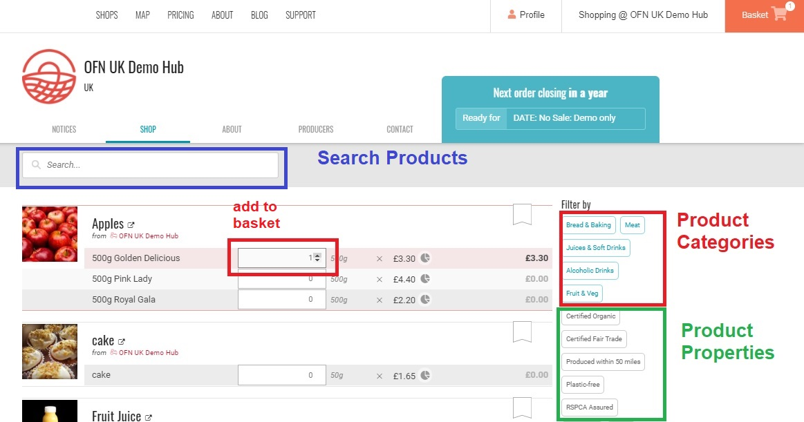
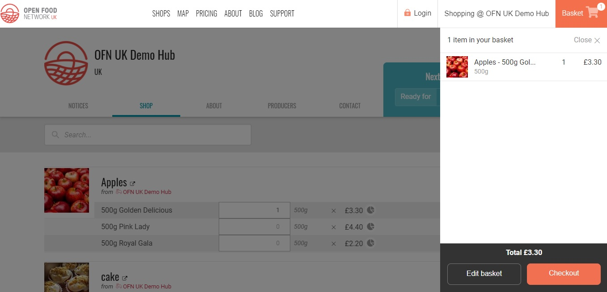

# واجهة المتجر

To open your online shop on Open Food Network and start selling, your enterprise must be registered as either a Producer Shop or Producer/Non-Producer Hub. Read more about the different Enterprise profiles[ here](../../your-quick-start-on-ofn-given-who-you-are.md) and [here](../enterprise-profile/).

The next essential steps are to set up [Shipping](shipping-methods.md) and [Payment](payment-methods.md) Methods for your enterprise. At this stage we also suggest creating [Enterprise Fees](enterprise-fees.md) \(a mark up added to the price each product charged by the supplying producer to cover admin and distribution costs\).

Opening and closing times of shop fronts on OFN, as well as the option to sub-select products for different dates and times of collection, are controlled by [Order Cycles](order-cycle/).

Shop fronts on OFN are highly flexible. Read more if you are interested in:

* [Providing different products and services to different customer groups](customer-management-and-conditional-displays-prices/).
* Would like only registered members to be able to place orders \([Private Shop](private-shopfront.md)\)
* Would like a 'dummy' [display only](display-only-order-cycles.md) shop front

## Customer View

When you have opened your shop front with an active [Order Cycle](order-cycle/), customers can view your products listed, search using the top left hand 'Search Box' and/or filter products by their [categories](../products-1/) or [properties](../products-1/product-properties.md):

To add products to their basket, customers on a laptop or PC/Mac will be able to either toggle the quantity up and down via the arrows to the right hand side of the quantity box or type in a value using the keyboard.  
On mobile and tablet quantities are added by selecting the quantity box and entering a value by the pop up keyboard.


Customers can view the items they have added to their basket by the drop down menu which appears when clicking on the basket in the top right corner.


