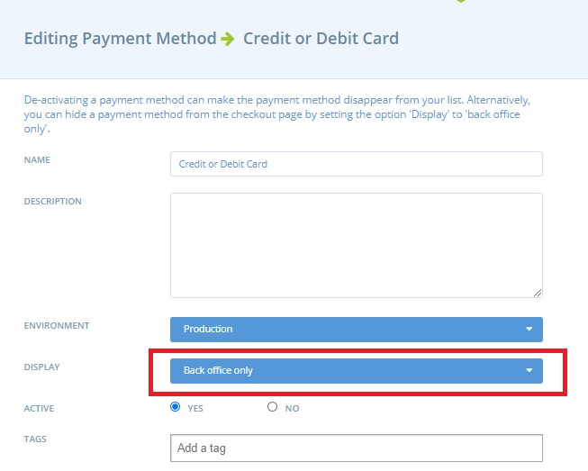
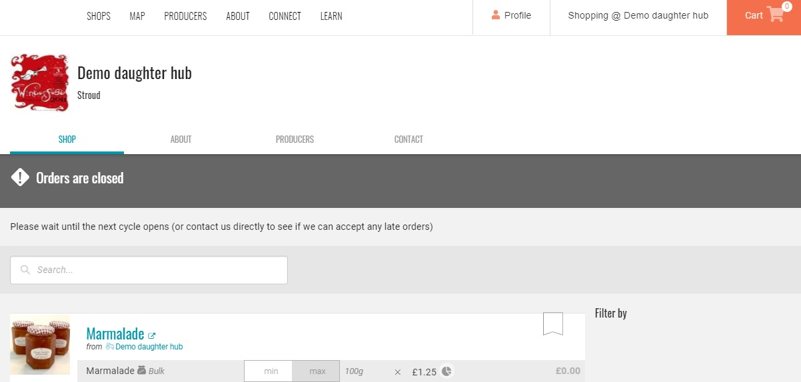

# Display only shopfront

In some cases, shop owners may want to be able to display products in their shop but not actually allow customers to checkout. For example to show their full product range \(which may vary seasonally\), or to give potential customers an idea of the products which will be on offer in the next order cycle, before it opens.

To setup a display only order cycle:

* Open an [Order Cycle](order-cycle/order-cycles-for-hubs.md) as usual, with the products you wish to display and date range for the order cycle to remain open.
* Change the 'Display' state of all your [Payment Methods](payment-methods.md) to 'Back Office Only'.  This can be done from Enterprises -&gt; Settings -&gt; Payment Methods -&gt; Edit:

Your shop will now be in the ‘display only’ state.  
Below is an example of how the shop appears to customers. It’s clearly marked as closed, but customers can see the product range.


When you next open a live order cycle from which you wish to sell produce, you will need to change the Display state of at least one [payment method](payment-methods.md) to 'Checkout and Back Office' or 'Checkout only'.


