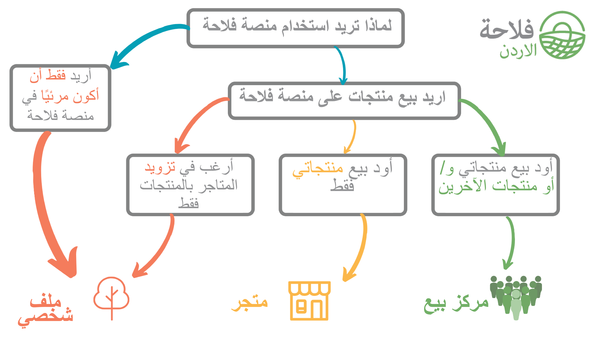

# اين يقع عملي في منصة فلاحة جو

لقد قمنا باعداد مخطط يوضح كيفية مشاكنك معنا, فاعتمادا على نمط مؤسستك الغذائية ضمن المخطط الموضح بالاسفل ستقوم باختيار طريقك.

نصنف العمل الغذائي من مزارع الى مؤسسة غذائية بثلاث طرق : [ملف شخصي](your-quick-start-on-ofn-given-who-you-are.md#almlf-alshkhsy), [متجر](your-quick-start-on-ofn-given-who-you-are.md#almtjr), [مؤسسة](your-quick-start-on-ofn-given-who-you-are.md#almussh)

تسمح لك مرونة **منصة فلاحة جو** بالتغيير من الملف الشخصي ، متجر، إلى مؤسسة \(أو العكس\) مع نمو عملك و / أو تغير الاحتياجات

## المؤسسة


سوق المزارعين ، مخطط صندوق الخضار،  مجموعات مجتمع الغذاء الاجتماعي ، تعاونيات الطعام ، مراكز الطعام ، حدائق السوق / المدينة ، متاجر البيع بالتجزئة ، بنوك الطعام ، موزعي الجملة ...


يمكن أن تتخذ المحاور أشكالًا عديدة ، ولكن في جوهرها ، يتم تصنيف مؤسستك بشكل أفضل على أنها "مؤسسة" فيمنصة فلاحة إذا كنت ترغب في بيع المنتجات المصنوعة بواسطة الآخرين. يمكنك بيع منتجاتك الخاصة للبيع بالتجزئة جنبًا إلى جنب مع منتجات المزارعين والخبازين والمزارعين الآخرين \("مؤسسة منتج"\) أو العمل فقط كموزع لبيع مجموعة من البقالة التي تنتجها المؤسسات \(المحلية\) \("مؤسسة غير منتجة" '\).


إذا كنت تفضل بيع المنتجات التي تصنعها فقط ، فإن تصنيف **"**[**المتجر**](your-quick-start-on-ofn-given-who-you-are.md#almtjr)**"** يناسب احتياجاتك بشكل أفضل.


### يمكن لـمنصة فلاحة جو أن تساعد مركزك في الازدهار من خلال:

1.زيادة زيارات متجرك الكترونيا  
2. تزويد عملائك بتجربة افتراضية لـ "سوق المزارعين"  
3. تبسيط مهامك الإدارية من خلال مستويات المخزون ، والأوامر ، والشؤون المالية ، وتعبئة التقارير في مكان واحد.  
4. القدرة على تلقي الطلبات بشكل دوري لتتلاءم مع العرض الموسمي ، وروتا الإنتاج والمزيد ...  
5. المساعدة في تنظيم الطلبات المتكررة المنتظمة مثل مخططات صندوق الخضار.  
6. المساعدة في بناء علاقات عمل قوية مع المنتجين المحليين ومؤسسات الأغذية التي تزودك بالسلع.

تتمتع المؤسسة بأكبر قدر من المرونة من بين أنواع المؤسسات الثلاثة في منصة فلاحة وقد تجد أنه من الضروري تعديل نوع مؤسستك إلى "[مؤسسة](your-quick-start-on-ofn-given-who-you-are.md#almussh)" من أجل فتح بعض الميزات الأكثر تعقيدًا التي يمكننا تقديمها.

**قم بتفعيل اعداداتك** على منصة فلاحة بشكل بسيطً باتباع 5 خطوات ، ما عليك سوى اتباع [**دليل البدء السريع هنا**](quick-start-guides/).

## المتجر


مزارعون ، خبازون ، مشاريع منزلية ، أصحاب بسطة صغيرة ...


يمكن أن تتخذ **المتاجر** أشكالًا عديدة ولكن في جوهرها ، يتم تصنيف مؤسستك على أنها "**متجر**" على منصة فلاحة إذا كنت ترغب في بيع المنتجات التي تصنعها


إذا كنت ترغب في بيع منتجات من صنع الآخرين كما أنت ، فمن الضروري التسجيل كـ **"**[**مؤسسة**](your-quick-start-on-ofn-given-who-you-are.md#almussh)**"**.


كمتجر وكذلك البيع مباشرة للعملاء من خلال واجهة متجرك ؛ يمكنك أيضًا تزويد بائعي التجزئة الآخرين \(المؤسسات\) في منصة فلاحة بمنتجاتك.


إذا كنت تفضل عدم تنظيم المبيعات للعملاء مباشرةً ولكنك ترغب فقط في تزويد مؤسسات منصة فلاحة بالبضائع ، فإن تصنيف **"**[**الملف الشخصي**](your-quick-start-on-ofn-given-who-you-are.md#almlf-alshkhsy)**"** يناسب احتياجاتك بشكل أفضل.


### يمكن لـمنصة فلاحة مساعدة متجرك على الازدهار من خلال:

1. Increasing your online visibility.
2. Streamlining your admin tasks with stock levels, orders, finances, packing reports all in one place.
3. Being able to sell in a manner which suits your needs, whether it is periodic orders to fit in with a seasonal potato harvest or a weekly cycle which matches your baking production... it's up to you!
4. Helping to build strong working relationships with local food distributors.

**Setting up on OFN** can be a simple 5-step process, just follow our quick starters guide [here](quick-start-guides/producer-shop-quick-setup-guide.md).

## الملف الشخصي


Farmers, Bakers, Growers, Individual Crofters, Cottage Enterprises, Small Holders....


The 'Profile' is the most basic enterprise classification on OFN and is ideal for micro enterprises or individuals who prefer to concentrate on growing, making, baking and/or producing food.

An OFN profile is ideal for **increasing your online visibility** and gives you the opportunity to connect in a simple manner with local retailers \(hubs\) who can manage customer sales for you.


If you'd prefer to organise sales to customers yourself then the '[shop](your-quick-start-on-ofn-given-who-you-are.md#shop)' or '[Hub](your-quick-start-on-ofn-given-who-you-are.md#hub)' classification is better suited to your needs.


### OFN can help your food enterprise thrive and prosper by:

1. Increasing your online visibility.
2. Helping to build strong working relationships with local food distributors and retailers \(OFN hubs\) to whom you supply goods.

**Setting up on OFN** can be a simple 4-step process; just follow our quick starters' guide [here](quick-start-guides/profile-only-quick-setup-guide.md).

